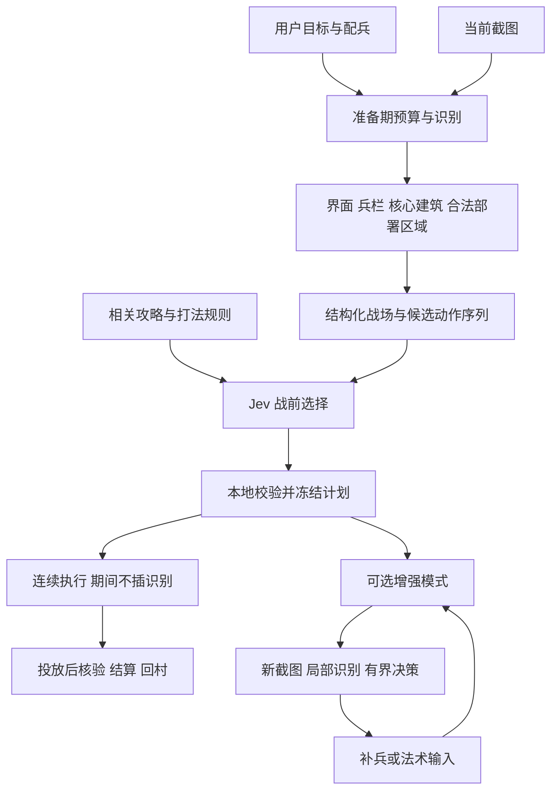

# AutoCOC 战前分析、快速投放与视觉模型实施计划

状态：**非训练部分的软件代码已交付；已整理本地候选素材，正式标注、模型训练及实战验收尚未开展。**

日期：2026-09-27。初版规划证据基线为 `1ae2ae2601eaf8398735d384586667e3d4484d82`，本轮核对的非训练实现基线为 `b4eb3960a0bb7a6f7c653edfc239c88415df752a`。使用说明见[战前视觉规划](../VISION_AGENT.md)。本轮细化[素材采集与标注计划](VISION_DATA_COLLECTION_PLAN.md)和[模型训练与交接计划](VISION_MODEL_TRAINING_PLAN.md)，只交付文档，不在此轮启动训练或实战。两份子计划分别维护采集/标签/拆分和训练/导出/验收细节，本文维护产品执行边界。

## 1. 需求基线与优先级

来源是“规划部落冲突 Agent 与识图优化”的讨论和用户在本次对话中的最新确认。以下约束覆盖早期讨论中“先做界面分类”“每阶段都重新识别”的优先级安排。

1. **优先用好战前准备期。**以用户提出的约 30 秒准备时间为规划前提，在实际剩余时间内完成界面、配兵、阵型和核心区识别，准备完整的可执行动作序列。
2. **第一版优先连续投放。**计划准备好后，本地程序按已确定的卡片、数量、位置和顺序连续执行；这段投放中不插入截图、OCR、模型推理或网络决策等待。
3. **战中 0.5 秒是增强目标。**以后需要中途跟法术或补兵时，尝试把“发起截图到对应输入动作完成”控制在 0.5 秒内。该目标包含识别、决策、选卡和输入，不能只报告识别耗时。
4. **增强目标不阻塞第一版。**若战中速度或准确性达不到要求，仍交付“准备期看清、确定方案、连续投放”的可用模式，不把半成品动态决策接入默认执行。
5. **阵型识别先聚焦核心区。**先识别决定进攻方向的关键建筑、核心位置和相对关系；具体核心区定义、建筑类别及首套打法，后续结合资料共同研究。
6. **界面、建筑与战中状态分别标注。**它们共享截图来源，但输出和验收不同。第一轮素材即覆盖前戏与主力阶段，先训练可接入的界面/建筑模型，再按数据条件训练动态模型；动态素材积累不再推迟到增强执行启用时。界面分类优先服务可靠的状态切换与异常判断。
7. **先完成代码，再训练出模型，再做联合阵型实测。**采集和资料准备可与代码开发同步；选哪些阵型、用哪套配兵做真实战斗，由用户与开发者在模型就绪后共同确定。

“后续再测试”指实际阵型效果和实机战斗测试。代码单元测试、模拟执行、数据校验、训练过程中的验证集评估仍随开发运行，不能把基本软件验证全部推迟到实战。

### 1.1 第一版交付边界

第一版交付准备期分析、核心区/建筑检测、界面分类、Jev 战前决策、本地连续投放、投放后核验、结算回村及报告。先覆盖约定的一套配兵和可见、稳定的兵栏布局，训练/推理工具支持后续增加类别与样本。

本次不承诺所有大本营等级、外观、地图、兵种与设备通用，不以“回字阵”等名称分类替代建筑位置，不要求第一版识别所有墙段、隐藏陷阱或每一个移动单位。依赖实时观测的精细前戏、英雄技能时机、法术跟随与中途补兵列为增强阶段；不为达到这些能力强行拖慢连续投放。

此次计划不扩展捐兵、聊天、购买、部落战等功能，也不重写整个 GUI 或现有日常任务系统。

## 2. 已有基础、缺口与历史证据

### 2.1 当前代码可复用的部分

| 模块 | 本次核对的事实 | 本计划的改动方向 |
| --- | --- | --- |
| [mumu.py](../../src/autococ/mumu.py)、[capture.py](../../src/autococ/capture.py) | 当前相关截图路径使用 PNG 压缩级别 1；原生截图工作进程提供隔离与超时边界 | 增加压缩级别 0 路径，再按基准评估内存像素交接；保留工作进程隔离 |
| [session.py](../../src/autococ/session.py) | `observe` 先保存截图，再识别；支持完整观察及按目的观察；动作有当前快照与时效检查 | 增加准备期预算、阶段事件、帧身份及冻结计划的独立执行契约 |
| [battle_vision.py](../../src/autococ/battle_vision.py)、[ocr.py](../../src/autococ/ocr.py) | 已有锚点守卫、已知卡位局部读数与全图回退 | 继续复用数字 OCR；减少准备期中的重复分析，为增强模式提供按需观察 |
| [strategies.py](../../src/autococ/strategies.py)、[strategy_config.py](../../src/autococ/strategy_config.py) | 已有 `BattleContext`、声明式动作与 planner 接口 | 在现有策略体系旁增加战前编排与有界动作计划，不让模型直接执行代码或输入 |
| [strategy_execution.py](../../src/autococ/strategy_execution.py) | 同一兵卡的一批普通兵已连续投放；切卡、消费核验及部分策略步骤仍观察，完成批次后还可能完整识别 | 新增显式的连续投放模式，不能只开快速识别开关就声称投放中无识别 |
| [terrain.py](../../src/autococ/terrain.py) | 已有当前画面下的部署边界、镜头变化相关处理 | 复用合法部署区域与坐标转换；核心位置不能直接当作合法落兵位置 |
| [building_vision.py](../../src/autococ/building_vision.py) | 已有模板建筑识别接口，类型为 `air_defense`、`spell_factory`；[模板清单](../../assets/catalogs/building_templates.json)的 `levels` 当前为空 | 增加训练模型提供的建筑观测；接口存在不代表已有可用阵型模型 |
| [hero_state.py](../../src/autococ/hero_state.py)、[reporting.py](../../src/autococ/reporting.py) | 已有英雄状态与结果报告代码 | 复用状态约束与证据，区分输入发出、实际消耗和战斗结果 |

### 2.2 历史测速，只作为优化依据

下列数据来自 2026-09-27 前序调查，本轮只读取材料，没有重新运行；不能称为新实现的验收结果。

| 测量 | 历史结果 | 边界 |
| --- | --- | --- |
| 完整识别 | 20 次平均约 3.732 秒，其中全图文字定位约 2.719 秒 | 不包含之前的截图；挑选的历史画面，不代表完整运行分布 |
| 原生取像素 | 12 帧中位数约 11.4 毫秒 | 只读村庄截图，未包含编码、传递与识别 |
| 压缩 PNG 与不压缩 PNG 的图片获取链路 | 两组各热身 1 帧、测量 10 帧；中位数约 477 → 180 毫秒 | 包含取帧、编码、文件交接、读取和解码；不包含识别、决策、输入 |
| 图片大小 | 每帧约 7.29 → 11.08 MB | 无压缩会增大文件，需控制留存，不应永久保存每一帧 |

主工作区的历史材料位置：`reports/vision-timing-20260927/耗时分析与训练说明.md`、`reports/capture-uncompressed-20260927/结果.md` 及对应 JSON。它们未随 Git 发布。不能把不同实验的中位数直接相加，宣称已经实现端到端 0.5 秒。

## 3. 目标架构与两种执行模式



### 3.1 默认：准备期规划与连续投放

进入敌方预览后，在剩余准备时间内确认画面稳定、军队身份及数量、卡位、核心区和可落兵范围。模型与攻略参与选择，程序编译出确定的动作顺序。冻结前校验数量预算、卡片来源、坐标、镜头、时限与适用配兵。

冻结后的每项动作包括选哪张卡、放多少、落在哪里、顺序和必要的短延时。连续投放从第一项选卡/输入开始，到最后一项计划内投放输入结束；这段期间不得调用截图、OCR、检测器、Jev 或隐含的重观察函数，也不得通过等待异步识别结果形成停顿。持续检查用户停止、执行期限和传输错误，这些检查不依赖截图。

“一次性全下”指一个预先确定的连续动作序列，并非同时点击所有位置。所有在本模式中计划使用的兵和法术都在序列中明确列出；是否使用英雄、攻城器和技能由已支持的配兵能力决定。需要等待“某建筑被摧毁”“主力进入核心”才能确定的动作不伪装成固定延时动作，放到增强模式。

投放结束后再截图确认兵数、法术消耗或可辨认状态，随后观察结算并回村。**投放后核验不计入连续投放时段，但必须保留。**没有证据确认的技能、部队与资源不能因为输入接口返回成功就记为成功。

### 3.2 增强：战中跟法术与补兵

准备期先生成开局与后续候选动作，战中只观察本次决策必需的信息，如主力区域、某个目标状态、法术余量。尽量由本地规则从预先准备的候选中选择；若调用 Jev，其网络往返、排队和校验全部计入延迟，不从统计中剔除。

按动作类型分别证明准确性、时效和延迟后才能启用。增强模式不改变默认连续投放模式的验收。尚未部署任何单位时，可以在条件已满足的前提下改选已校验的连续方案；已经部分部署后，禁止切回开局方案重新整批投放。

## 4. 时间预算与时效契约

### 4.1 准备期预算

约 30 秒是规划窗口假设，不是从识别完成后重新开始计时。使用当前游戏画面的剩余倒计时、截图时间戳及单调时钟计算截止点；加载、缩放、稳定画面和识别已经消耗的时间都包含在窗口内。不同模式或客户端实际窗口不同时，以验证过的实际窗口为准。

建议初始预留至少 5 秒给最终检查、首个动作与异常退出，数值在本机测量后调整。可用分析预算为：

`可用预算 = 该帧读到的剩余秒数 - 该帧至今的经过时间 - 预留时间`

状态时效采用取帧开始或可验证的更早时间，不能用推理完成时刻给旧图“续命”。倒计时无法可靠读取时，只能使用已验证且保守的倒计时估计；没有这类证据就不宣称还有完整 30 秒。

| 顺序 | 预算内工作 | 终止或降级规则 |
| --- | --- | --- |
| 1 | 云雾/弹窗检查、稳定缩放与镜头、当前兵栏核对 | 时间不足或坐标条件不成立时，不进入自动投放 |
| 2 | 核心建筑检测、核心区计算、合法落点与入口候选 | 只补读决定本次方案的缺失字段；不在期限内无限重试 |
| 3 | Jev 结合攻略选择候选，或选择已验证的本地候选 | 设置硬超时；过期响应丢弃。Jev 失败时仅允许使用事先具备完整前提的本地方案 |
| 4 | 最后一次必要核对、冻结动作与执行预算 | 确认本场、镜头、兵栏及计划版本一致，预留时间足够才开始 |

模型加载、权重校验、攻略加载和网络客户端初始化在搜敌之前完成。程序不必耗满准备时间，计划可靠且已就绪即可开始执行。

准备期内无法看清时，优先在仍明确处于预览阶段、按钮仍有效且时间足够时换敌或退出；期限已到或场景不明时停止新增投放并进入状态确认/结果收集。不能在自动开战后继续把旧画面当成敌方预览，也不能为了赶时间盲下。

### 4.2 战中 0.5 秒的统计口径

对一次完整、预先定义的动作单元记录以下时间点：

- `t_request`：请求本次新截图。
- `t_pixels`：本次像素可用。
- `t_state`：需要的字段与时效校验完成。
- `t_decision`：决策、数量与落点校验完成。
- `t_input_done`：该动作单元所需的最后一次输入调用完成，包括必要选卡、按下/抬起、点位输入与调用中的等待。
- `t_effect_verified`：之后通过画面或其他有效证据确认游戏实际消费/生效。

用户目标对应 `t_input_done - t_request ≤ 0.5 秒`。另报 `t_effect_verified - t_request`，不把“输入已发出”冒充“游戏效果已确认”。测量对象可以是一次法术投放或一次补兵动作；多只兵的一组动作必须报告整组结束时间及每次动作耗时，不能拿第一只兵的延迟代表整组。

按截图、预处理、推理、决策、网络和输入分项报告冷启动、热运行 P50/P95、最大值、超过 0.5 秒比例、失败、拒识、回退和超时。未成功执行的尝试也保留在统计分母，单独标明状态，避免只统计成功快帧。

增强模式的初始准入建议是：在最终确定的测试集与动作类型上，热运行 P95 ≤0.5 秒，且正确性门槛通过。该标准是计划目标，不是现状；实时动作仍有自身截止时间，过期不执行。达不到时明确标记未达标，继续使用默认连续模式。

### 4.3 默认模式的整批投放速度门槛

“投放中零识别”与“投放足够快”分别验收。第一版采用以下初始工程门槛，尚未经实战验证：

- `T_burst` 从第一项选卡/输入调用开始，到最后一项计划内输入调用完成；包括所有选卡、投兵、法术/技能输入、传输排队、按下/抬起及固定延时，不扣除慢输入或策略内等待。投放后核验另计。
- 准备期冻结必要输入数 `N`：每个完整点击（包括按下与抬起）算一次，选卡与落点分别计数；只计算完成该配兵计划必需的输入，不用多余选卡、空操作或重试增加预算。
- **每场完整投放要求 `T_burst ≤ min(15 秒, 1 秒 + 0.25 秒 × N)`。**例如 40 次落点加 4 次选卡，`N=44`，整批上限为 12 秒。该门槛约束整批，不是只测第一只兵或同一卡片内的快段。
- 为每套受支持配兵冻结输入序列、`N`、总上限、固定延时和输入后端，在首次独立实测前记录到验收配置；同时报告每场总时长、单次输入耗时、相邻落兵间隔和总体 P50/P95/最大值。失败、中止、超时仍保留在尝试统计中，不按快速成功计入。
- 执行器使用该总上限作为投放截止时间，并约束单条输入调用的剩余超时；达到期限即停止新增输入，保留在途动作的不确定状态。按时中止只证明超时处理有效，不表示该场投放通过。

超限的配兵/后端不能被标为支持快速连续投放。先优化输入与延时；确需调整门槛时，必须更新设计依据并开启新的完整验收窗口，不能在看过失败结果后提高阈值、删去等待时间而追溯宣称通过。此门槛独立于战中增强的 0.5 秒目标。

## 5. 需要识别的内容与训练路线

| 任务 | 输入与标签 | 拟用方法 | 产物 |
| --- | --- | --- | --- |
| 界面类型 | 保留完整 UI 的截图；界面类别、遮挡/转场等标签 | 预训练 MobileNetV3-Small 迁移学习，与原有方法对照 | 场景类别、置信度、未知/拒识结果 |
| 核心建筑 | 战场图；建筑类别、位置框、可见性 | 小型目标检测模型，先比较 YOLO26n 与 YOLO11n | 建筑类别、位置、置信度与画面坐标关系 |
| 核心区与关系 | 建筑检测结果；少量人工核心中心/范围参考 | 先用可解释的几何与规则聚合，必要时再研究额外区域模型 | 核心中心/范围、相对入口方向、关键目标距离与证据 |
| 兵栏身份和数量 | 卡片区域、身份/来源及精确数字 | 保留已有识别与局部 OCR；不足时再训练卡片分类器 | 兵种、来源、数量和不确定字段 |
| 战中状态 | 同一场战斗的时间序列；建筑/部队区域/技能状态 | 在增强阶段选择检测、状态分类与跨帧跟踪组合 | 状态变化、主力区域与证据新鲜度 |

具体模型、首轮参数、支持类别映射、现有 ONNX 包限制和实施阶段见[模型训练计划](VISION_MODEL_TRAINING_PLAN.md)。其中 S/B 为首批必训模型，R/U 为动态增强模型，卡片身份模型按现有方法评估结果决定；不训练 Jev。当前代码仅直接加载 scene/building 包，单核心几何聚合不能冒充多个核心区、墙体通路或动态状态。

建筑类别先围绕大本营、影响所选打法的关键防御及必要外圈目标设计。[采集计划](VISION_DATA_COLLECTION_PLAN.md)已给出初始类别/属性表与多核心参考标法，实施时结合支持版本、配兵和覆盖冻结启用子集。核心价值随策略 profile 定义，不能用一个固定大框代表所有打法。普通建筑框不会自动提供墙体通路、建筑朝向、部队路径或最佳打法。

“核心区未知”是合法输出；目标漏检或被特效遮挡不等于目标已被摧毁。跨帧状态需要正向证据或经过验证的组合条件，继承现有建筑识别中“不以消失证明摧毁”的约束。

### 5.1 模型训练与部署

1. 训练环境：拟在用户约 128 GB 内存的 Mac 上训练，先核实芯片、系统、PyTorch/MPS 支持及磁盘。内存容量不等于 GPU 性能；本次没有连接 Mac 或安装依赖。
2. 从预训练权重微调。界面模型先训练分类层，再以小学习率微调部分主干；检测模型按已审定的框与类别微调。超参数由验证集确定，不写成已验证最优值。
3. 保留基线模型、训练配置、随机种子、数据版本、拆分清单、训练日志与最佳验证权重。只根据训练/验证集调参，最终测试集保持封存。
4. 导出适合 Windows 本机的模型，优先评估现有 ONNX Runtime 的兼容路径；比较导出前后输出和精度。训练环境与运行环境分离，不把训练依赖强制塞进日常助手启动环境。
5. 每个模型带元信息：类别表、输入尺寸、颜色顺序、缩放补边、坐标还原、后处理、模型哈希、代码/数据版本、适用游戏画面范围与验证记录。
6. 在实际 Windows 推理设备上预热和测完整链路，再决定是否量化或改执行提供器。不同精度/量化版本分别验收；厂商推理跑分不能代替本机结果。

图片预处理保留所需边缘 UI；训练和推理采用同一套变换。不直接照搬会裁掉按钮的中心裁剪。界面数据不使用不符合游戏实际的镜像与大角度旋转；建筑数据增强也必须保持位置标签与部署坐标关系正确。

模型权重本地加载，训练与验收截图默认保留本地，不自动上传外部训练平台。大数据集和权重不作为普通 Git 文件提交；在实现阶段补齐对应忽略规则与本地产物索引，明确来源和版本。

## 6. 数据集与标注安排

### 6.1 数据来源与清单

具体采集矩阵、标签边界、数量预算、目录、时序和复核规则以[素材采集计划](VISION_DATA_COLLECTION_PLAN.md)为准。主工作区已整理 146 张候选原图，但均未正式标注、拆分，游戏版本未知；素材在本地 `训练素材/`，未随 Git 发布，不代表已有可训练或已验收数据集。

优先整理已有本地截图和用户共同选定的素材，补充真正缺失的阵型与阶段。采集工具先实现去重、筛选与标注导入，不在代码开发期间自动开战收集大量截图。网上攻略/阵型图可辅助制定标签和候选打法，必须记录来源；渲染风格或分辨率不同的材料不能代替游戏原图验收集。

拟定样本清单字段：样本 ID、来源、捕获时间、游戏版本、分辨率、会话/战斗 ID、阵型分组、阶段、图片哈希、标注版本、标注/复核状态、所属数据拆分。已有本地素材清单只覆盖其中一部分；正式 schema、组级拆分、标注导入与训练快照工具仍待实现，不原位覆盖旧清单。

### 6.2 三类标注

- **界面标签**：使用现有场景名做映射，覆盖村庄、军队、搜敌/敌方预览、战斗、结算和异常。弹窗覆盖背景时统一标注优先级；真正未覆盖的界面保留未知。新分类器未覆盖的部落等场景继续交给现有路径，不因模型类别少就误判。
- **建筑框与核心区参考**：按原图坐标标建筑类型和可见区域，记录遮挡与不支持外观；另保留人工核心中心/范围参考，用于检验聚合规则。类别边界、是否标低可见度目标先形成示例。
- **战中状态**：同一目标的状态与时序关联、主力所在区域、英雄/法术可用状态。第一轮同步采集前戏/主力与成功/失败片段，先标关键事件；精细标注按选定动作和训练覆盖扩充，不把连续帧当独立事件。

旧识别结果或模型可以辅助预标注，但未经人工检查不能当作真值。独立测试集必须有可追溯人工复核，遵守[已有视觉验收规则](../VISION_EVALUATION.md)。无法确定的标签标为未知或排除相应字段，不伪造零值。

### 6.3 拆分与规模

先按阵型分组，再约束会话/战斗及相邻帧，确保相同阵型或近似连续画面不跨训练与测试。可从约 70%/15%/15% 的分组拆分起步，比例服从类别覆盖与独立性；像素哈希与近似去重配合，人工复核重复阵型。

300–800 张有差异截图仅作为界面分类原型的初始量级参考。建筑检测按类别实例数、等级/外观、布局和困难样本统计覆盖，不承诺几百张足够。最终测试集的阵型、配兵、规模与重复次数待用户共同选择后冻结，不能边看测试错误边把该集合继续当独立测试集。

采集使用有上限的帧缓存和样本筛选，只持久化准备期关键帧、投放后、结算、异常及选中的训练样本。无压缩运行帧可在非实时路径另存压缩证据；设置目录额度并明确保留清单，不自动清理原有证据或用户选定数据。

## 7. 接口与关键实现约束

以下对象名称是拟定的内部设计，不是当前已有 API。优先适配现有 `BattleContext`、`StrategyStep` 和报告格式，避免制造两套互不相通的执行系统。

| 拟定对象 | 必需内容 | 使用约束 |
| --- | --- | --- |
| `FramePacket` | 帧 ID、本场 ID、取帧时间、像素/尺寸、镜头与坐标变换、可选证据路径 | 识别与点击必须使用可追溯的同一帧/坐标体系；内存帧不得被工作进程提前覆盖 |
| `PreparedBattleState` | 场景、剩余准备时间、兵栏身份/来源/数量、合法区域、建筑与核心区、置信度和证据 | 缺失字段显式未知，不把前一局或旧帧字段复制成当前识别结果 |
| `FrozenBattlePlan` | 本场/计划 ID、依据帧、模式、动作序列、资源预算、执行窗口、适用布局和决策来源 | 冻结后不接受迟到的模型响应修改；只能执行已校验动作 |
| `ActionReceipt` | 动作 ID、尝试次数、输入完成时间、发出数量、已核验消耗、未确认/失败原因 | 传输成功与游戏消费分别计数；单次动作不能因超时自动重放 |

### 7.1 截图与内存交接

先实现可配置的 PNG 级别 0 与完整计时，作为小改动基线。只有测量显示仍有必要，再实现有界共享内存或经过测量的像素交接方案。共享缓冲需有帧序号、所有权/生命周期、尺寸和像素格式检查，避免上一帧、撕裂帧、进程退出后的句柄泄漏。

保留现有截图接口兼容适配与原生进程超时隔离。不能为了提速将无法中断的 SDK 调用直接搬进主线程，也不能把跨进程复制成本从统计中拿掉。故障只在安全边界恢复观察，不切换传输重放不确定的游戏输入。

### 7.2 连续执行器

- 准备期核对本次要使用的全部卡片和数量，生成有限、坐标合法的动作列表；数量、资源限额、停止条件由代码校验。
- 首版仅接纳已经验证“开始投放后卡位仍可按既定映射使用”的布局。需要滚动兵栏、重新定位、身份未知或来源混淆的情况不自动进入无观察模式；后续具备独立验证后再扩展。
- 选卡动画缩放、耗尽后的卡位行为、预览转战斗的 UI 差异必须在回放与联合实测中覆盖。无法验证的卡片不靠固定坐标猜测。
- 不全局放宽 `GameSession` 的快照时效校验。为冻结计划设置独立、短且有界的执行许可，绑定本场、最后核对帧、镜头、显示器、卡位与计划哈希；超时、停止、传输错误后立即失效。
- 投放循环仅做本地队列、时间、数量预算和停止检查；现有 `_consume`、`_fresh` 等会观察的路径必须明确分离。用调用计数测试证明投放窗口内观察与模型调用次数为 0。
- 按第 4.3 节冻结整批投放截止时间；测试慢输入和过长固定延时能触发中止，即使观察调用始终为 0 也不能绕过速度门槛。
- 记录每条输入结果，某条输入结果不确定时停止剩余队列，不重投之前的部分。投放结束/中止后取得新证据，核验整批消耗并保留不确定数量。
- 本模式无法及时看见投放期间新出现的视觉弹窗，这是明确的能力边界。用准备期检查、短执行窗口和投放后核验降低影响；如实际布局/配兵不适用，就拒绝该模式，不暗中插入整图识别。

### 7.3 Jev 与攻略

准备期把核心区、配兵、可用入口及局部打法组合整理成有限候选，Jev 选择或评分，再由程序验证并编译。候选应随阵型变化，允许不同清边侧、主力入口和兵种顺序，不限定为几个固定整场脚本。对于首版不具备的动作条件，候选生成阶段就排除。

攻略整理为适用配兵、关键局面、行动理由、顺序和失败条件的短条目，只取与本局有关内容。用户目标中的精确数量、限额与停止条件进入结构化配置并由代码执行。自然语言歧义在开跑前处理，不占用战前倒计时临时追问。

Jev 当前接收文本/JSON，不直接看截图，也不提供客户微调或 LoRA；本项目训练的是视觉模型。SDK/HTTP 适配器应可替换并固定实际验证过的模型版本。先用录制响应与模拟客户端写好代码，真实调用只传本次决策所需的结构化游戏信息和攻略片段，记录模型版本、耗时与候选 ID。

凭据通过环境变量提供，不写入配置样例、日志或 Git。未配置凭据时报告不可用并使用事先校验过的本地决策路径；不能报告为已接入成功。准备期调用有总时限，迟到响应不会改变已经开始执行的计划。

### 7.4 配置与用户界面

复用现有日常助手与策略选择入口，新增设置只覆盖本功能：是否启用模型识别、模型目录、准备期余量、连续/增强模式、证据留存和统计。字段名称与 TOML schema 在实现 PR 中定稿，不在本文件伪造可直接运行的配置。

保持旧配置可运行，已有策略不被静默切到无观察执行。训练入口单独命名，避免与项目中军队准备相关的 `train` 任务混淆。缺少模型或类别映射不兼容时明确提示能力不可用。GUI 分别显示“计划就绪”“输入已发出”“消费已核验”“战斗完成”。

## 8. 实施阶段、依赖与产物

基线实现交付了 M0–M4 中非训练/素材部分的代码与模拟验证；当时排除的 M2 数据清单、标注导入、训练和导出工具，现在由两份子计划安排后续实施，本轮仍只写计划。人工构造观测、既有回归图与模拟模型只证明软件契约，不证明新模型精度或实际战术效果。

| 阶段 | 工作内容与主要位置 | 交付与进入下一阶段条件 |
| --- | --- | --- |
| M0 基线与接口 | `session.py`、`reporting.py`、现有基准脚本；定义准备期、投放期与动作计时、状态和结果契约 | 冻结指标、日志字段和受支持的第一版执行边界；单元测试覆盖时钟、超时和计数 |
| M1 截图与观察 | `mumu.py`、`capture.py`、`images.py`、`battle_vision.py`；PNG 0、按需识别、缓存时效；内存路径按测量决定 | 截图前后像素/坐标一致，故障可退出，离线对照与模拟传输通过，旧路径可回退 |
| M2 数据与模型代码 | 拟新增数据清单、去重/分组/标注导入、训练/导出/评估工具和本地模型适配层，接入 `vision.py`/`building_vision.py` | 没有真实权重时可验证全部工具契约；导入错误、类别不符、过期帧、未知状态有明确结果 |
| M3 战前编排与连续执行 | `combat.py`、`strategies.py`、`strategy_config.py`、`strategy_execution.py`、`terrain.py`；准备期限、核心聚合、冻结计划和独立执行窗口 | 使用模拟场景完成准备到回执；投放中观察/模型调用为 0；整批限时、慢输入、数量预算、部分失败、停止和不重放用例通过；实际速度在 M6 验收 |
| M4 Jev、配置和产品接线 | 可替换 Jev 适配器、攻略条目、`config.py`、`desktop.py`、`gui.py` 和报告；增强路径先留接口与禁用状态 | 模拟客户端完成端到端软件回放，兼容旧配置；第一版所需代码齐备，未把模拟通过当实战成功 |
| M5 数据定稿与模型训练 | 按采集计划 D0–D4、训练计划 T0–T5 补齐工具、复核标签、冻结拆分；核实 Mac 后微调、导出 | 训练完成并有可复现模型包；Windows 能加载，导出前后结果可比；数据不足时如实列缺口 |
| M6 离线验收与联合阵型测试 | 独立数据评估、Windows 性能、Jev 旁路判断；之后共同选阵型和配兵做有限实战 | 先满足默认模式的识别、准备期限、执行和回村证据要求，再决定是否扩大测试 |
| M7 可选战中增强 | 补充动态数据/模型、按需观察、动作期限与快速跟法术/补兵；复用前面接口 | 按动作类型验证完整 ≤0.5 秒目标；未达标保持禁用，不阻塞默认模式交付 |

依赖主线：`M0 → M1/M2 → M3 → M4 → M5 → M6`，M7 在基础路线稳定且确有动态数据后推进。静态与动态资料从第一轮同步准备，R/U 训练按子计划 T6 推进；M5 不能在数据与训练硬件未就绪时虚报完成。用户尚未选定首套配兵和测试阵型，不影响通用数据/训练工具开发。

每阶段以一个或少量可审查 PR 交付；新实现从最新远端默认分支创建独立 `agent/<task-name>` worktree，相关修复继续原分支。提交前只纳入任务变更、运行相关检查并开 ready PR；检查未通过时保留 PR 和阻塞信息。合并按用户已有授权范围执行，不用计划文档替代合并授权。

### 8.1 实现文件与测试对应

| 变化 | 优先扩展的现有测试 | 需要新增的有意义用例 |
| --- | --- | --- |
| 截图、传输、像素与观察 | `test_mumu.py`、`test_capture.py`、`test_session.py`、`test_battle_vision.py` | 像素一致、帧生命周期、超时清理、缓存失效、错误传输不重放 |
| 规划与连续投放 | `test_strategy_runtime.py`、`test_strategies.py`、`test_combat.py`、`test_deployment.py` | 准备期限、计划冻结、执行期零观察、切卡/数量预算、部分投放、迟到决策与停止 |
| 核心建筑与状态 | `test_building_vision.py`、`test_terrain.py`、`test_hero_state.py` | 输出契约、坐标还原、镜头变化、核心区未知、漏检不等于摧毁 |
| 数据、模型、配置与报告 | `test_evaluate_vision.py`、`test_config.py`、`test_reporting.py`，按新增模块补测试 | 同阵型泄漏、标签冲突、模型元信息、导出差异、模拟/实测结果隔离 |

## 9. 验收方法与交付判定

### 9.1 代码与工具验收

M0–M4 逐步扩展相关现有测试，使用虚拟时间和模拟输入验证超时与停止，不靠真实等待凑覆盖。不为文案变化添加测试。新增模型接口用固定输出与小型测试产物验证格式/坐标，真实精度留到 M5/M6。

在已为当前 checkout 安装项目与开发依赖的 Python 环境中，可使用以下现有测试入口；具体阶段只运行相关子集，阶段集成后再跑必要回归：

```powershell
python -m pytest -q tests/test_mumu.py tests/test_capture.py tests/test_session.py tests/test_battle_vision.py
python -m pytest -q tests/test_strategy_runtime.py tests/test_strategies.py tests/test_combat.py tests/test_deployment.py
python -m pytest -q tests/test_building_vision.py tests/test_terrain.py tests/test_hero_state.py tests/test_evaluate_vision.py
```

以上保留原有验证入口；基线实现新增了 prepared_battle、model_vision、Jev、倒计时、证据额度和计时报告测试，历史执行结果见实现 PR。独立模型包评估命令见[模型包接口](../MODEL_PACKAGE.md)。训练/导出工具仍待按[训练计划](VISION_MODEL_TRAINING_PLAN.md)实现，本轮文档核对没有重新运行这些产品测试。

### 9.2 模型离线验收

- 界面模型报告每类 precision/recall/F1、混淆矩阵、覆盖率、拒识率及未知/遮挡的错误接受数。原有 [ACCEPTANCE.md](../ACCEPTANCE.md) 的 VIS-01/02 整体验收门槛保留；只覆盖战斗相关类别的小模型不得宣称通过包括部落界面在内的全项目视觉验收。
- 建筑模型报告各关键类别的检测 precision/recall、定位误差、mAP、遮挡/不同等级表现；核心区另报中心/范围误差与入口判断一致性。指标不能只合并成一个平均分。
- [训练计划第 7 节](VISION_MODEL_TRAINING_PLAN.md#7-验收层次与建议首轮门槛)给出建筑、场景、核心/入口与动态事件的初始离线门槛；实施时结合首套配兵和支持范围，在打开最终测试集前冻结配置。未冻结、样本不足或未达标时，只做原型/旁路建议，不进入模型控制的真实部署。
- 数量采用精确值匹配，身份、数量、来源和状态分开统计。某个字段无法确认不按正确计入。
- Windows 推理测试同时记录设备、执行提供器、模型/数据版本、输入尺寸、冷启动、热运行与完整链路；模型单独推理很快不等于准备或动作链路达标。

### 9.3 准备期与默认连续模式验收

1. 每个试验保留实际准备倒计时、预算消耗、关键识别、候选、决策依据、冻结时间和首个动作时间；证明在保留余量内准备就绪。
2. 准备预算耗尽、未知画面、核心区不足、错误配兵、镜头变化和模型不可用均有明确分支，不用“全部立即下兵”掩盖识别失败。
3. 连续投放期间截图/OCR/检测/Jev 调用数为 0，投放数量与动作预算一致；停止和传输错误能打断剩余队列。还须逐场通过第 4.3 节的整批速度门槛：`T_burst ≤ min(15 秒, 1 秒 + 0.25 秒 × N)`；零观察、平均值达标或只发完部分部队不能代替整批按时完成。
4. 计划、输入发出、消费核验分别有账。没有核验到的卡片或技能保持未确认，部分失败保留原状态；不自动重放不确定动作。
5. 投放后、结算、回村分别有证据，收益和星数有读取边界，人工操作单独标记。自动化成功不等于获胜，获胜也不等于全部计划步骤执行成功。

### 9.4 用户参与的实测安排

模型训练和离线校验后，用户与开发者共同确定首套配兵、核心偏置/集中/分散等测试阵型、对照打法、场次数和停止条件，再开始有限实测。先核对开局识别与建议，再验证连续投放，最后看战果；不要先自动刷很多场来代替选样与诊断。

保留失败战例和人工干预，不用相邻截图增加独立样本数，不把同一阵型反复调参后的结果称为未见过阵型的泛化。连续无人值守属于进一步验收，仍遵循 [ACCEPTANCE.md](../ACCEPTANCE.md) 与 [DAILY_ACCEPTANCE.md](../DAILY_ACCEPTANCE.md) 的适用要求；本轮视觉/战术原型不会自动通过捐兵等无关功能的验收。

## 10. 回退、交付与维护

| 条件 | 行为 |
| --- | --- |
| 新模型缺失、版本或类别不匹配 | 禁用相应模型能力；只有旧路径满足本次所需字段与预算时才使用旧路径，否则退出/停止 |
| Jev 超时、不可用或结果不合法 | 仅选择准备期内已校验的本地候选；没有候选就不自动开打 |
| 关键建筑/核心区置信度不足 | 标为未知，有限补读；不生成依赖该目标的精确落点 |
| 准备时间不够 | 仍在明确可退出的预览阶段时退出或换敌；其他阶段停止新增投放并确认状态 |
| 连续投放期间输入结果不确定 | 中止剩余队列，投放后重新取证；不重放、不静默切换传输 |
| 战中增强超时或状态过期 | 丢弃该次过期动作，保留回执；不能重新执行已经部分完成的开局方案 |
| 战中 0.5 秒目标未达到 | 增强模式保持未达标/禁用，默认准备期规划与连续模式独立交付 |

发布采用显式功能配置，旧策略继续可用。模型、标签映射和预处理作为一个版本包切换，回退时整体回退；配置和数据不做破坏性迁移。记录实际代码提交、模型哈希、数据版本、配置及所用执行模式，便于复现。

### 10.1 Windows 临时防息屏与防睡眠流程

本节独立定义项目要求，新克隆无需依赖本机未入库的 `AGENTS.md`。适用于 Windows 上的开发、测试、基准、训练等待与实机任务；Mac 训练进程的保活由其运行环境另行配置，不能用 Windows 请求证明 Mac 已保活。

1. **创建本任务的持有者。**开始任务前，用任务专属目录保存状态和 `stop.request` 停止入口；记录持有进程 PID、启动时间和脚本路径。后台启动时使用 `Start-Process -WindowStyle Hidden`，避免弹出窗口。预先设置有限截止时间，例如 90 分钟；预计超过时先设置覆盖该任务的有限时长，避免任务仍运行而保活已到期。
2. **由持续存活的同一线程申请。**调用 Windows `SetThreadExecutionState(ES_CONTINUOUS | ES_DISPLAY_REQUIRED | ES_SYSTEM_REQUIRED)`，对应 `0x80000003`。检查返回值非 0；在同一线程周期性检查停止标志、截止时间并续期，例如每 2 秒一次。不能在立即退出的命令里调用后就宣称持续生效。
3. **核实成功再开始长任务。**状态记录申请返回值、显示器/系统请求标志、心跳和截止时间，确认持有进程仍存活。申请失败时记录原因并排查，不继续无人值守长测试。任务进行及等待结果期间检查持有者是否仍有效；即将到期且任务未完成时，在原请求到期前建立并验证新的有界请求，再释放旧请求。
4. **所有退出路径释放。**完成、失败、取消、用户停止或期限到达时，通过本任务停止入口使持有线程退出循环；在 `finally` 内调用 `SetThreadExecutionState(ES_CONTINUOUS)`（`0x80000000`），检查返回值非 0，写入释放状态。不要让单纯续期循环绕过有限截止时间。
5. **核实清理。**按 PID、启动时间和路径核对身份，确认本任务的释放状态与进程退出。若等待退出超时，先排查已确认属于本任务的持有者，不按进程名批量结束其他任务；未确认释放时明确报告清理未完成。异常终止后的状态文件可能过期，须以匹配身份的进程是否仍在运行核对，不能只看文件里的 `running`。
6. **保留系统边界。**不永久修改电源计划，不关闭锁屏或屏幕保护程序，不模拟鼠标/键盘，不释放其他任务持有的请求。该请求只防空闲息屏和自动睡眠，不保证阻止手动睡眠、合盖、锁屏或系统强制休眠。

### 10.2 状态维护

本计划的阶段状态随实现 PR 更新。代码完成、模型训练完成、离线通过、有限实战通过、连续运行通过分别记录，不合并成一个“完成”。当前阶段状态如下：

| 项目 | 当前状态 | 待取得的证据 |
| --- | --- | --- |
| 需求与实施文档 | 主计划已交付；本轮补充独立采集、训练与交接计划 | 本轮规划索引/本地链接审计、`git diff --check` 与人工一致性核对；不代表软件或模型已验收 |
| M0–M4 非训练软件实现 | 代码及模拟测试已交付，M2 训练/素材工具排除 | 准备期、连续投放、本地模型、Jev、配置/GUI/报告；详见实现 PR 的测试结果，不能替代权重与实战验收 |
| M5 数据与模型 | 146 张本地候选图已整理；正式标注、拆分、训练和导出未开展 | 按独立子计划完成工具、数据复核、Mac 训练与 Windows 模型包验收 |
| M6 离线与联合实测 | 计划中 | 独立评估、用户选样、Windows 与实战报告 |
| M7 战中增强 | 计时接口已实现，执行模式保持禁用 | 动态数据、精度与完整动作延迟证据；不宣称实机达到 0.5 秒 |

## 11. 待确定事项与推进方式

| 待确定事项 | 确定时机 | 是否阻塞当前代码准备 |
| --- | --- | --- |
| 第一套配兵、支持版本/等级与启用类别 | 初始类别/核心参考规则已在采集计划定义；正式数据冻结时确定适用子集 | 不阻塞工具与试标；阻塞对应能力的正式训练/验收 |
| Mac 芯片、可用 GPU 后端、数据传递目录 | 开始真实训练前 | 不阻塞训练工具编写；阻塞硬件训练验收 |
| 训练数据覆盖和标注规模 | 数据盘点后、模型实验前 | 不阻塞代码；不足时不能宣称模型训练已足够 |
| Jev 凭据配置与真实服务连通 | 真实调用前，在本机用环境变量配置 | 模拟客户端和本地决策可先完成；真实连通未验收 |
| 建筑/核心区准入配置 | 训练计划已有初始门槛；支持范围明确后、测试集打开前冻结版本 | 不阻塞接口与原型；阻塞正式验收与模型驱动实战 |
| 最终测试阵型、配兵、场次及停止条件 | 模型就绪后，由用户与开发者共同选择 | 不阻塞代码与训练；实战依此开展 |

此前的非训练软件任务已完成代码交付；随后本地整理了候选截图。本次用户要求核对采集/训练的清晰程度并补齐可交接的具体计划，未要求立即实施训练。工具开发、真实数据补采/标注、权重和实战各按子计划分阶段取得证据，不用规划或构造观测测试代替。

## 12. 外部技术依据

以下官方资料在 2026-09-27 的本次会话中核对；具体依赖与模型版本在实现/训练阶段锁定，不把网页跑分当作本机性能。

- [Jev 模型与输入、定制方式](https://docs.typesafe.ai/models)：文本/JSON 输入，不提供客户 LoRA；通过状态和问题规则加入领域资料。
- [YOLO26](https://docs.ultralytics.com/models/yolo26)：轻量目标检测候选，使用自有游戏数据微调并独立评估。
- [MobileNetV3-Small](https://docs.pytorch.org/vision/main/models/generated/torchvision.models.mobilenet_v3_small.html)：界面分类的预训练小模型候选。

未承诺型号一定最优。选择以本项目独立样本精度、拒识表现、实际 Windows 延迟、导出可用性和维护成本为依据。
